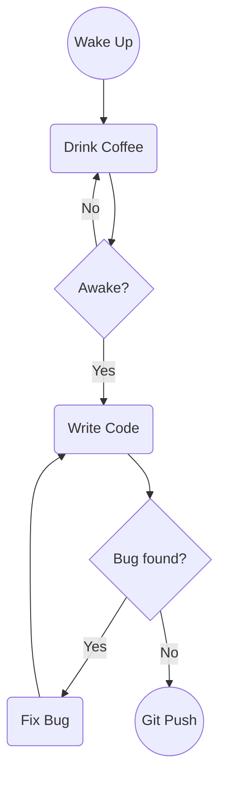

What's up, fellow code monkeys? Grab your extra-large coffee (or Diet Coke, if you're trying to watch the waistline like me). Today, we're diving deep into the guts of **bpmn-js**.

If you've ever been tasked with building a web-based workflow editor, you've probably stumbled across this beast. At its core, bpmn-js takes the heavy, enterprise-grade BPMN 2.0 specifications and slaps them onto a canvas using a sweet underlying library called `diagram-js`.

Let's break down the elements and see how this thing actually ticks under the hood. No academic BS, just straight frontend talk.

## The Building Blocks: BPMN 2.0 Elements

BPMN 2.0 (Business Process Model and Notation) is basically a standardized way to draw flowcharts so both the suits (business people) and us nerds (developers) can understand what the heck is supposed to happen in a system.

Here's the TL;DR of the elements you'll be wrangling:

### 1. Flow Elements (The Meat and Potatoes)
*   **Start Event**: Where the magic begins. Usually a plain circle.
*   **End Event**: Where the process finally dies. A thick-bordered circle.
*   **Intermediate Event**: Stuff that happens in the middle—like catching a message, waiting for a timer, or throwing an error.
*   **Gateway**: The traffic cops. These diamond-shaped bad boys split or merge the flow. You've got Exclusive (XOR - pick one path), Parallel (AND - do all the things), and Inclusive (OR - pick whatever fits).
*   **Task**: The actual work. Could be a user clicking a button, or a script running in the background.
*   **Subprocess**: A task that contains its own mini-workflow. Great for hiding complex spaghetti code logic.

Here's a quick Mermaid representation of a standard developer morning workflow:



### 2. Swimlanes (Pools & Lanes)
Think of a **Pool** as an entire organization or a separate system, and **Lanes** as the specific departments or roles within it.
*   *Frontend Dev Lane*: Writes React/Vue.
*   *Backend Dev Lane*: Writes Java/Go.
*   They both swim in the "IT Department" Pool.

### 3. Connecting Elements (The Wires)
*   **Sequence Flow**: The solid arrows. They show the exact order of execution within a single Pool.
*   **Message Flow**: The dashed arrows. Used when two different Pools need to talk to each other (like an API call from Frontend to Backend).

### 4. Data & Annotations
*   **Data Object / Data Store**: Shows where the data is coming from or going to (like a database or a JSON payload).
*   **Text Annotation**: Literally just sticky notes you leave on the diagram so the next guy doesn't lose his mind trying to understand your logic.

---

## The Unsung Hero: `diagram-js`

Alright, let's talk about the real MVP. You can't talk about bpmn-js without bowing down to `diagram-js`. It's the core engine built by the bpmn.io team that handles all the heavy lifting of drawing, editing, and interacting with the canvas.

Why do we love it?
*   **SVG Rendering**: It uses pure SVG. That means it scales perfectly, looks crisp on Retina displays, and doesn't choke the browser with thousands of DOM nodes like a heavy React component tree might.
*   **Event-Driven**: It has a killer publish/subscribe EventBus.
*   **Extensible AF**: Modular architecture. You want a custom shape? Inject a custom module.

### Inside the Engine Room: Core Components

Let's pop the hood and look at the engine parts. When you instantiate a bpmn-js modeler, you're actually spinning up a bunch of `diagram-js` services.

#### 1. `ElementFactory` & `GraphicsFactory`
The `ElementFactory` creates the logical JSON objects (the brain), while the `GraphicsFactory` maps those logical objects into SVG elements on the canvas (the muscle).

#### 2. `Renderer`
This guy takes the SVG elements and actually paints them onto your screen. Supports both SVG and Canvas, though SVG is the standard here.

#### 3. `EventBus` (The Nervous System)
This is where you'll spend 90% of your time writing custom logic. It's a central hub for all events.

*Look at this beauty:*
```javascript
// Hooking into the event bus like a seasoned pro
const eventBus = bpmnModeler.get('eventBus');

eventBus.on('element.click', function(event) {
  const element = event.element;
  console.log('Bro, you just clicked on:', element.id);
  
  // Want to open a custom properties panel? Do it here.
  if (element.type === 'bpmn:UserTask') {
      openMyChunkyReactModal(element);
  }
});
```

#### 4. `Modeling` (The God Mode API)
Never, ever mutate the SVG or the internal objects directly. Always use the `Modeling` API. It handles the updates, triggers the right events, and makes sure you don't corrupt the XML.

```javascript
const modeling = bpmnModeler.get('modeling');
const elementRegistry = bpmnModeler.get('elementRegistry');

// Find a task
const task = elementRegistry.get('Task_1');

// Update its name without breaking the universe
modeling.updateProperties(task, {
  name: 'Refactor Spaghetti Code'
});
```

#### 5. `CommandStack`
Ever made a mistake and hit `Ctrl + Z`? The `CommandStack` is what makes undo/redo possible. Every action via the `Modeling` API gets pushed here.

#### 6. `Rules`
The bouncer at the club. It decides if you're allowed to connect Node A to Node B. (e.g., You can't draw a Sequence Flow out of an End Event. The Rules engine stops you).

---

## Wrapping Up

And there you have it, folks. `bpmn-js` might look intimidating with its massive API and complex XML outputs, but once you understand that it's just a set of BPMN 2.0 rules wrapped around a slick SVG rendering engine (`diagram-js`), it becomes a lot more approachable.

Now, if you'll excuse me, I have a bug ticket waiting for me, and my coffee is getting cold. Peace out! ✌️
